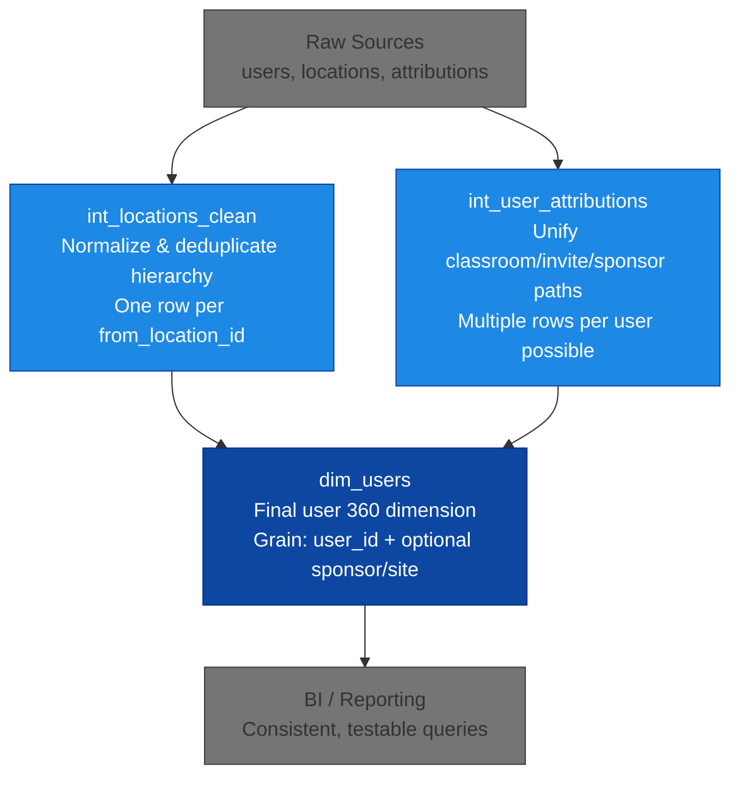

# dbt User 360 Dimension in BigQuery
[](https://opensource.org/licenses/MIT)
[](https://docs.getdbt.com/docs/dbt-versions/core-upgrade/Older%20versions)
[](https://docs.getdbt.com/docs/core/connect-data-platform/bigquery-setup)
[](https://github.com/space-lumps/bigquery-dbt-user-dimension/releases)

## Overview

This dbt project builds a clean, testable user 360 dimension (`dim_users`) in BigQuery. It aggregates user identity with resolved hierarchical location data and multi-path attribution (sponsor/site/classroom) from anonymized platform data patterns (professional networking/resource platform).

**Key goals**:
- Resolve hierarchical locations with deduplication and prioritization.
- Unify attribution paths while preserving unlinked users.
- Deliver a BI-ready mart with enforced grain, schema tests, and documentation.

## Why dbt? (Problem → Solution)

Originally a monolithic SQL query in a BI tool that combined location normalization, multi-path attribution, and evolving user attributes. It worked for small daily updates but became fragile and hard to maintain.

**dbt refactor benefits**:
- **Modularity** — Static logic (location cleaning, attribution unification) in intermediate models, protected from frequent `dim_users` changes.
- **Testability** — Layered tests catch issues early.
- **Consistency** — Centralized transformations ensure uniform logic across consumers.
- **Performance** — Intermediate tables speed up downstream reads; full daily refresh is fast (<50k rows).

Result: Fragile query → production-grade, modular pipeline.

## Data Flow



## Location Resolution Logic

A single `from_location_id` can map to multiple types (city, county, state, country) with potential duplicates or hierarchies. The pipeline collects candidates, ranks cities by distance (e.g., ST_DISTANCE in miles) + heuristics (e.g., regex checks for address-like strings), picks the best per type, and emits one consistent row per source location — preventing ambiguous geography in downstream queries.

This mapping prioritizes the nearest city if within ~10 miles (or if the original locale resembles a suburb/address), grouping users into standardized cities. For example, scattered suburbs are aggregated under their parent city. The approach enables accurate mapping, regional grouping, and reliable BI visualization without data fragmentation.

## User Attribution Unification

Multiple paths (classroom membership, educator assignments, email invitations, direct sponsor invite codes) are normalized into a stacked intermediate model. Independent Learners (type 'IL') are excluded from invitation-based paths. The model produces multiple rows per `user_id` where applicable; `dim_users` selects the canonical attribution for each user.

## Materialization Strategy

- Intermediates → tables (persist complex transforms, faster downstream reads and easier debugging)
- Mart (`dim_users`) → table (optimized for BI/reporting queries)

Materialization can be changed in `dbt_project.yml` (e.g. to view) if needed.

## Tests & Quality

`marts/marts_schema.yml` includes:
- `not_null` on `user_id`
- `unique` on `user_id`
- `dbt_utils.unique_combination_of_columns` on [user_id, sponsor_id, site_id]
- `dbt_utils.expression_is_true` to ensure location completeness for users with `location_id`

---

## Viewing Documentation (Showcase Mode)

This repository is optimized for static code review and portfolio demonstration. No live BigQuery connection or real data is included, so full `dbt run`, `dbt test`, and `dbt docs generate` commands will fail without credentials — this is intentional.

Included for zero-setup docs:
- Pre-generated `target/manifest.json` and `target/catalog.json` with column types, descriptions, and metadata (from a real run).

### Steps to view dbt docs locally:
1. Make sure you are in the project directory and your Python virtual environment is active (if using one).
2. Generate the manifest file (parses models, sources, tests, and yml documentation — no credentials needed):
   `dbt parse`
3. The repo contains pre-populated `target/catalog.json` with full column details. If you ever need to regenerate or adjust it:
   - Keep the structure and unique_ids matching those in `manifest.json`.
   - Update `metadata.generated_at` to a recent timestamp if desired.
   - The current file includes detailed types and explanatory comments for all sources, intermediate models, and the final mart.
4. Start the documentation server:
   `dbt docs serve`

Open http://localhost:8080 in your browser. You should see:
- Full lineage graph
- Column names + descriptions (from *.yml files)
- Data types + custom comments (from catalog.json)
- Model descriptions, tests, and dependencies

If the server fails to start due to "Address already in use":
`lsof -i :8080`
`kill -9 <PID>`
then retry:
`dbt docs serve`

### Optional: Experiment with a real BigQuery connection

If you want to run the full pipeline (compile, run, test, generate real docs):

1. Create a GCP project and enable BigQuery (free tier is sufficient for small data).
2. Install the Google Cloud SDK.
3. Authenticate locally:
   `gcloud auth application-default login`
4. Copy `profiles.example.yml` to `~/.dbt/profiles.yml` and update project and dataset to your own values.
5. Run standard dbt commands:
   `dbt debug`               # should say "All checks passed!"
   `dbt compile`
   `dbt run`                 # executes models into your real BigQuery dataset
   `dbt test`
   `dbt docs generate`       # pulls real column descriptions, etc. from BigQuery
   `dbt docs serve`          # open http://localhost:8080

See the official guide: [dbt + BigQuery setup](https://docs.getdbt.com/docs/core/connect-data-platform/bigquery-setup)

---

### Running the Full Pipeline (Requires BigQuery)

This repo includes a single SQL script (`dummy_data/setup_dummy_data.sql`) that recreates the bronze_raw dataset and populates it with dummy data. Reviewers can run this in their own BigQuery project (free sandbox tier works perfectly).

#### Steps for reviewers:

1. Create or select a Google Cloud project (free tier / sandbox is sufficient):
2. Go to https://console.cloud.google.com
3. Create a new project if needed (no billing required for small tests).

#### In the BigQuery console:
1. Create a new dataset named `bronze_raw` (or use an existing one).
2. Open a new query tab.
3. Copy-paste the entire content of `dummy_data/setup_dummy_data.sql`.
4. Replace all occurrences of `dbt-user-dimension-demo` with your actual project ID (found in the top bar or IAM & Admin → Settings).
5. Run the script (click Run or Ctrl+Enter).

Update `models/sources.yml`:
1. Change database: `dbt-user-dimension-demo` to your actual project ID.
2. Keep schema: `bronze_raw` (or update if you used a different dataset name).

Set up dbt credentials (one-time):
Install gcloud SDK if not already installed.
Run:
```bash
gcloud auth application-default login
```
Copy `profiles.example.yml` to `~/.dbt/profiles.yml` and update project and dataset to match your setup.

Run the dbt pipeline:
```bash
dbt debug
dbt run
dbt test
dbt docs generate && dbt docs serve
```

Open http://localhost:8080 to view the full documentation with real metadata.

---

## Repo Structure

```
.
├── dbt_project.yml
├── profiles.example.yml
├── packages.yml
├── package-lock.yml
├── .python-version
├── .gitignore
├── dummy_data/
│   └── setup_dummy_data.sql
├── models/
│   ├── sources.yml
│   ├── intermediate/
│   │   ├── int_locations_clean.sql
│   │   ├── int_user_attributions.sql
│   │   └── intermediate_schema.yml
│   └── marts/
│       ├── dim_users.sql
│       └── marts_schema.yml
├── macros/
│   └── bigquery_catalog_fix.sql
├── target/
│   ├── catalog.json
│   └── manifest.json
├── deprecated/
│   └── macros/
│       └── utils.sql
└── README.md
```

## Compatibility

* dbt Core 1.11+
* `dbt-bigquery` adapter

---

## License

MIT License

Copyright (c) 2025-2026 Corin Stedman (space-lumps)

See the [LICENSE](LICENSE) file for full details.